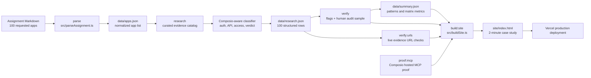

# Composio Connector Research Agent

This repo is a runnable take-home submission for Composio's AI Product Ops Intern role. It researches 100 requested apps, classifies their connector buildability, verifies weak claims, and generates a single-page case study.

## What This Proves

- A repeatable agentic workflow for connector research across 100 apps.
- Composio-native design: SDK sessions, custom agent-callable tools, toolkit lookup, and a hosted MCP proof path.
- Verification discipline: evidence requirements, repeatable checks, low-confidence flags, live URL checks, and human audit records.
- A reviewer-friendly final artifact: `site/index.html`.

## Architecture



## Setup

```bash
npm install
cp .env.example .env
```

The 100-app dataset is a curated evidence-backed catalog with official docs URLs. External keys are only needed for optional live refreshes and proof steps. See [docs/MANUAL_SETUP.md](docs/MANUAL_SETUP.md) for exactly what to create on free/free-trial tiers.

## Commands

```bash
npm run parse       # Parse the assignment app list into data/apps.json
npm run research    # Generate structured connector research rows
npm run verify      # Run repeatable verifier and produce audit/summary files
npm run verify:requirements # Check assignment coverage, schema, page sections, and public language
npm run verify:urls # Check evidence URL reachability and write data/evidence-url-checks.json
npm run build:site  # Build site/index.html from data artifacts
npm run proof:mcp   # Create a Composio hosted MCP proof artifact, if configured
npm run all         # Parse, research, verify, and build the site
npm run audit       # Full local audit: data, requirements, URL checks, and TypeScript
npm run check       # Type-check scripts
```

## Output Files

- `data/apps.json`: normalized 100-app input set.
- `data/research.json`: structured connector research output.
- `data/verification.json`: verifier findings and human audit sample.
- `data/summary.json`: metrics used by the case study.
- `data/requirement-checks.json`: assignment-readiness checks.
- `data/evidence-url-checks.json`: live evidence URL reachability checks.
- `data/run-logs/mcp-proof.json`: redacted Composio MCP proof output.
- `site/index.html`: final single-page case study.

## Current Generated Results

- 100 apps researched across 10 categories.
- 58 apps classified as `ready_now`.
- 31 apps classified as `ready_with_limits`.
- 9 apps classified as `needs_outreach`.
- 2 apps classified as `not_buildable_today`.
- 20 apps in the human audit sample.
- 184/184 evidence URLs passed live reachability checks.
- First-pass audited accuracy: 70%; final audited accuracy after verification/correction: 100%.

## How To Read The Results

The page leads with the operational answer: which connectors are ready now, which need limited work, which require outreach, and which are not buildable today. The table keeps each claim tied to evidence. The verification section shows first-pass misses and corrected results so the accuracy story is visible rather than hand-waved.

## Docs

- [Manual setup](docs/MANUAL_SETUP.md): API keys, free/free-trial accounts, and what you still need to do before final submission.
- [Project walkthrough](docs/PROJECT_WALKTHROUGH.md): what each part of the repo does and how to explain it in an interview.
- [Verification guide](docs/VERIFICATION.md): assignment requirements mapped to checks and artifacts.
- [Data methodology](docs/DATA_METHODOLOGY.md): how the research data was captured, classified, and reviewed.

## Composio Design Notes

The core project is a TypeScript research agent. It is designed to use Composio in two complementary ways:

- **SDK path:** custom agent-callable tools such as `FIND_OFFICIAL_DOCS`, `LOOKUP_COMPOSIO_TOOLKIT`, `CLASSIFY_CONNECTOR`, and `VERIFY_EVIDENCE`.
- **MCP path:** `npm run proof:mcp` creates a Composio session with `mcp: true`, connects with an MCP client, lists available tools, and writes a redacted proof artifact.

Relevant Composio docs:

- Sessions via MCP: https://docs.composio.dev/docs/sessions-via-mcp
- Custom tools/toolkits: https://docs.composio.dev/docs/extending-sessions/custom-tools-and-toolkits
- Toolkit catalog: https://docs.composio.dev/toolkits
- CLI: https://docs.composio.dev/docs/cli

When `COMPOSIO_API_KEY` is absent, `proof:mcp` records an honest skipped proof artifact instead of fabricating one.

## Deployment

The project is configured for Vercel as a static deployment from the `site/` directory.

```bash
npm run all
npx vercel --prod
```

If Vercel auth is unavailable, `site/index.html` can be hosted through GitHub Pages or any static file host without code changes.
